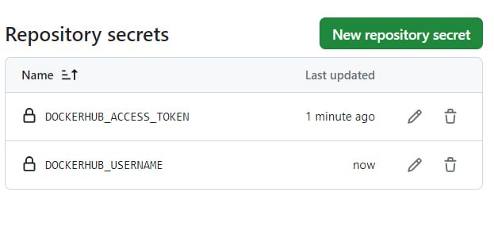
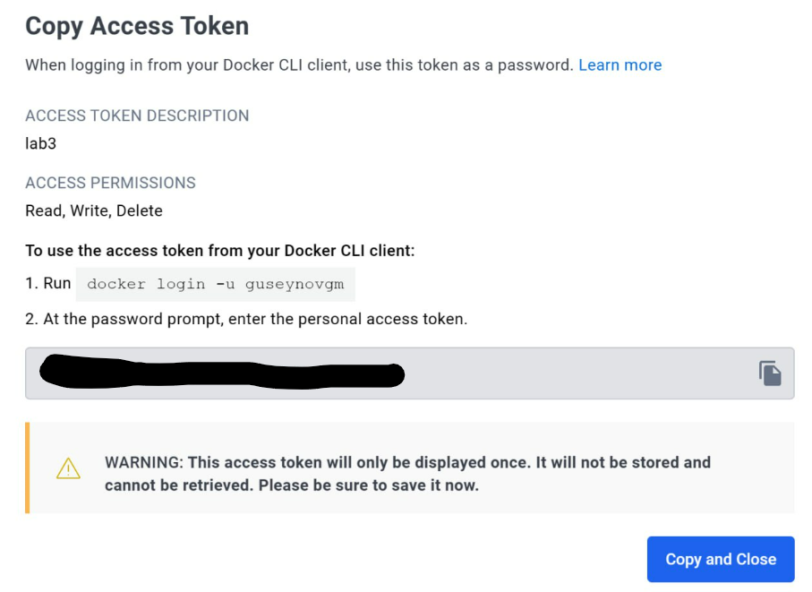
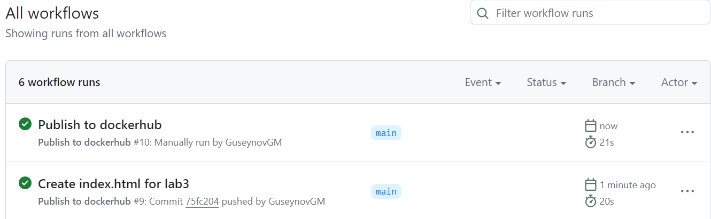
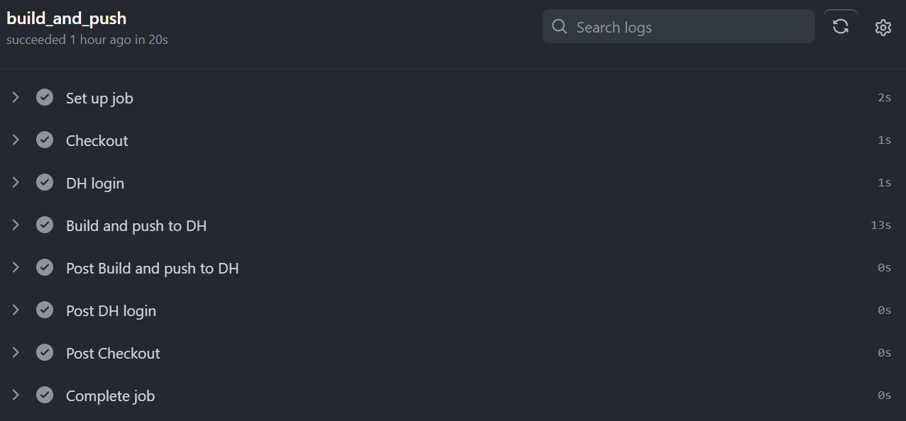
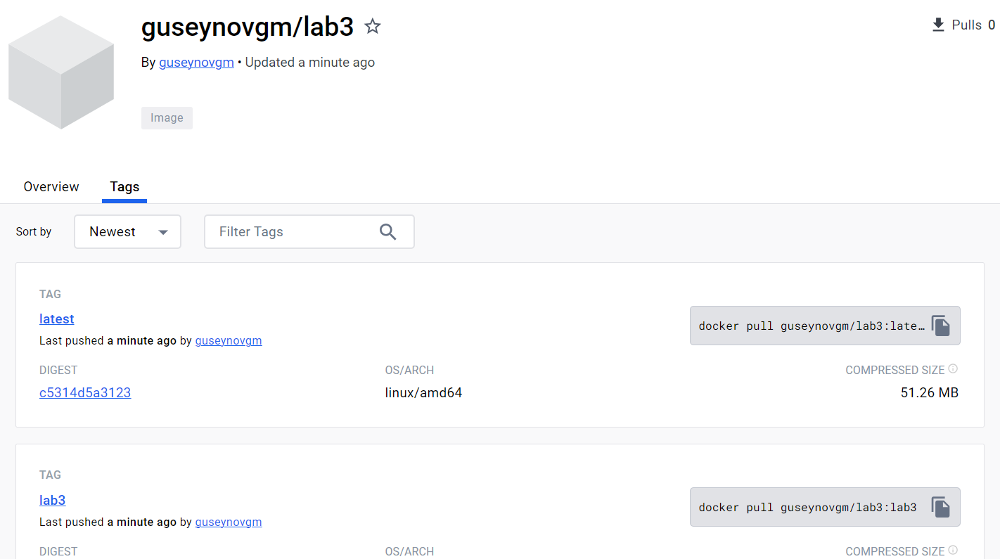
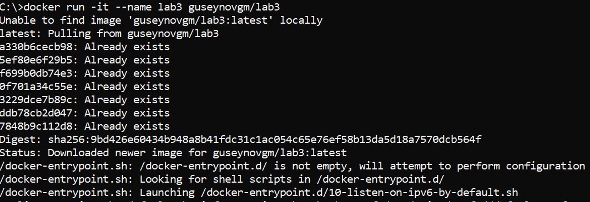

#### University: [ITMO University](https://##3itmo.ru/ru/)
#### Faculty: [FICT](https://fict.itmo.ru)
#### Course: Cloud Systems and Services
#### Year: 2023/2024
#### Group: K34212
#### Authors: Kostenko Darina Alekseevna & Spevak Elena Aleksandrovna & Guseynov Guseyn
#### Lab: Lab3

# **Отчёт по лабораторной работе №3**
# Настройка CI/CD

**Цель работы:** сделать, чтобы после пуша в репозиторий автоматически собирался докер образ и результат его сборки сохранялся куда-нибудь.

**Ход работы**

Будем использовать GitHub Actions. Создадим .yml файл в директории **.github/workflows/**.

```yml
name: Publish to dockerhub

on:
  push:
    branches: [ "main" ]
    paths:
      - "lab3/**"
      - ".github/workflows/**"
  workflow_dispatch:

jobs:
  build_and_push:
    runs-on: ubuntu-22.04

    defaults:
      run:
        working-directory: "/lab3/files"

    steps:
      - name: Checkout
        uses: actions/checkout@v4

      - name: DH login
        uses: docker/login-action@v3
        with:
          username: ${{ secrets.DOCKERHUB_USERNAME }}
          password: ${{ secrets.DOCKERHUB_ACCESS_TOKEN }}

      - name: Build and push to DH
        uses: docker/build-push-action@v5
        with:
          context: ./lab3/files/
          push: true
          tags: guseynovgm/lab3:lab3 , guseynovgm/lab3:latest
```

- **name** - название сценария
- **on** - правила запуска сценария (мы указали два правила)
1) автозапуск после пуша в папку с третьей лабораторной работой
2) ручной запуск через интерфейс гитхаба (__workflow_dispatch__).

- **jobs** - добавление работы для actions

    - запускать работу будем на __ubuntu-22.04__.
    - __working-directory__ указывает на директорию по умолчанию
    - __steps__ содержит последовательность шагов для выполнения задачи

Для каждого шага необходимо указать параметры:
- **name** - имя шага
- **uses** - название сценария из маркета GH actions
- **with** используется для передачи параметров в сценарий


**Checkout**

__actions/checkout__ производит извлечение репозитория, чтобы остальные шаги смогли получить доступ к файлам

**DH login**

__docker/login-action__ используется для авторизации в докерхаб.

Чтобы этот шаг отработал необходимо предварительно создать секреты в репозитории гитхаб



- __DOCKERHUB_USERNAME__ логин пользователя
- __DOCKERHUB_ACCESS_TOKEN__ токен докерхаба (нужен, чтобы вносить изменения в образы на докерхаб)

Получение токена в докерхаб:



**Build and push to DH**

__docker/build-push-action__ используется для сборки образа и пуша в докерхаб

- __context__ - папка с dockerfile всеми файлами, чтобы собрать образ
- __push:true__ - говорим, что надо будет сделать пуш в докерхаб
- __tags__ - указываем теги для образа - **lab3** и **latest**

**Запуск Action**

Зайдем в раздел actions на гитхаб и посмотрим на работу пайплайна



Пайплайн можно раскрыть и посмотреть логи:



После работы пайплайна, образ появился в докерхабе: https://hub.docker.com/r/GuseynovGM/lab3



Чтоб скачать и запустить можно использовать команду:

`docker run -it --name lab3 guseynovgm/lab3`

На рисунке ниже видно, что контейнер подтянулся и запустился. Последней строчкой было выведено, что бот запущен.

Собранный образ успешно запустился:



**Вывод**

Был настроен CI/CD пайплайн с помощью которого после пуша в репозиторий автоматически собирается докер образ и пушится в докерхаб
