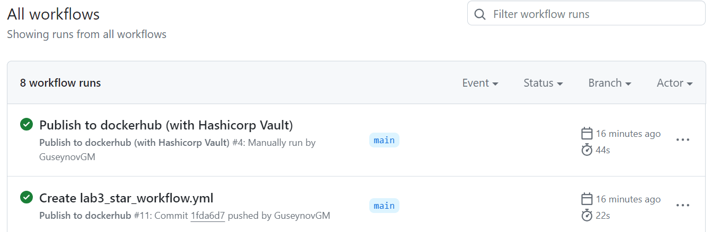

#### University: [ITMO University](https://##3itmo.ru/ru/)
#### Faculty: [FICT](https://fict.itmo.ru)
#### Course: Cloud Systems and Services
#### Year: 2023/2024
#### Group: K34212
#### Authors: Kostenko Darina Alekseevna & Spevak Elena Aleksandrovna & Guseynov Guseyn
#### Lab: Lab3

# **Отчёт по лабораторной работе №3 со звездочкой**
# Настройка CI/CD (со звездочкой)

**Цель работы:** сделать красиво работу с секретами (поднять Hashicorp Vault).

**Ход работы**

Для запуска локального Hashicorp Vault сервера используем команду:

`./vault server -dev -dev-root-token-id root`


Во втором терминале настроим Vault:

- установим переменные окружения
```
export VAULT_ADDR=http://127.0.0.1:8200
export VAULT_TOKEN=root
```

- добавим секреты
```
./vault kv put secret/dockerhub DOCKERHUB_USERNAME=guseynovgm DOCKERHUB_ACCESS_TOKEN=token
```

- добавим политику для доступа к секретам
```
./vault policy write dockerhub-secret-reader - <<EOF
path "secret/data/dockerhub" {
    capabilities = ["read"]
}
EOF
```

- запишем в переменную токен для чтения и выведем его на экран

Значение этого токена добавим в секреты гитхаба под именем VAULT_TOKEN

```
./vault policy write dockerhub-secret-reader - <<EOF
path "secret/data/dockerhub" {
    capabilities = ["read"]
}
EOF

echo $GITHUB_REPO_TOKEN
```

- проверим, что секреты записаны в хранилку
```
VAULT_TOKEN=$GITHUB_REPO_TOKEN ./vault kv get secret/dockerhub
```


**GH actions**

Создадим новый .yml файл в директории **.github/workflows/**.

```yml
name: Publish to dockerhub (with Hashicorp Vault)

on:
  workflow_dispatch:

jobs:
  build_and_push:
    runs-on: self-hosted

    defaults:
      run:
        working-directory: "/lab3/files"

    steps:
      - name: Checkout
        uses: actions/checkout@v4

      - name: Hashicorp Vault secrets import
        uses: hashicorp/vault-action@v2.4.0
        with:
          url: http://127.0.0.1:8200
          tlsSkipVerify: true
          token: ${{ secrets.VAULT_TOKEN }}
          secrets: |
            secret/data/dockerhub DOCKERHUB_USERNAME ;
            secret/data/dockerhub DOCKERHUB_ACCESS_TOKEN

      - name: DH login
        uses: docker/login-action@v3
        with:
          username: ${{ env.DOCKERHUB_USERNAME }}
          password: ${{ env.DOCKERHUB_ACCESS_TOKEN }}

      - name: Build and push to DH
        uses: docker/build-push-action@v5
        with:
          context: ./lab3/files/
          push: true
          tags: guseynovgm/lab3:lab3_star , guseynovgm/lab3:latest
```

**Шаги в файле**

**Checkout**

__actions/checkout__ производит извлечение репозитория, чтобы остальные шаги смогли получить доступ к файлам

**Hashicorp Vault secrets import**

__hashicorp/vault-action__ Подключается к секретохранилке и импортирует секреты в переменные окружения

- __url__ - адрес на котором локально запущена секретохранилка
- __token__ - токен для секретохранилки (импортируем из секретов гитхаба)
- __secrets__ - список секретов на импорт

**DH login**

__docker/login-action__ используется для авторизации в докерхаб.

Теперь на этом шаге используем секреты из переменных окружения

**Build and push to DH**

__docker/build-push-action__ используется для сборки образа и пуша в докерхаб


**Запуск Action**

Чтобы запустить action c vault нужно сначала добавить собственный runner (через настройки репозитория).

Запущенный раннер выглядит так:


Скриншот с результатом успешного запуска пайплайна



Скриншот удачного пуша в докерхаб


**Вывод**

Был настроен CI/CD пайплайн с использованием секретохранилки. После пуша в репозиторий автоматически собирается докер образ и пушится в докерхаб

